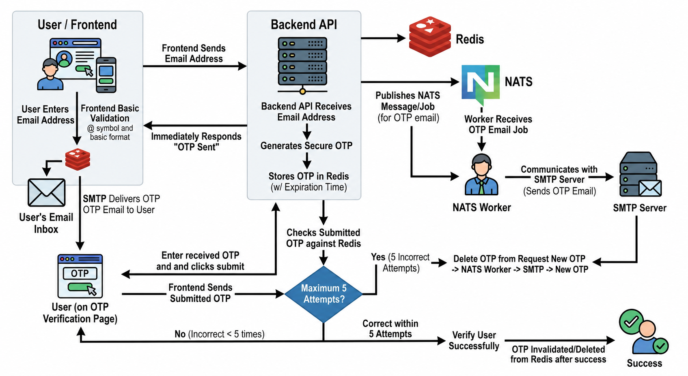

# OTP Authentication Service

An email-based OTP authentication service built with **FastAPI, Redis, NATS, and SMTP**.

The service generates a secure OTP, stores it temporarily in Redis, and uses NATS to process email delivery asynchronously through an SMTP server.

## Architecture



### OTP Flow

```text
Frontend
   │
   │ Email
   ▼
Backend API
   │
   ├──► Redis
   │     └── Store OTP + Expiration
   │
   └──► NATS
          │
          ▼
      NATS Worker
          │
          ▼
        SMTP
          │
          ▼
     User's Email
```

For verification:

```text
User submits OTP
       │
       ▼
Backend API
       │
       ▼
     Redis
       │
       ▼
 Verify OTP
       │
   ┌───┴────┐
   │        │
Correct   Incorrect
   │        │
   ▼        ▼
Success   Attempt++
            │
            ▼
       Maximum 5 attempts
```

## Why Redis?

Redis is used for temporary OTP storage. OTPs are short-lived authentication data, so Redis's fast access and built-in key expiration (TTL) make it a good fit.

The default OTP expiration time is **5 minutes**.

## Why NATS?

NATS separates the API from the email-delivery process.

The backend publishes an OTP email job to NATS, and a worker consumes the job and sends the email through SMTP. This keeps email delivery separate from the API and allows additional workers to be added later if needed.

If NATS is unavailable, the application can fall back to direct SMTP delivery.

## Why SMTP?

SMTP was chosen because it is the **standard protocol for sending emails and is very easy to set up**.

Most email providers already provide SMTP servers, and Python has built-in SMTP support through `smtplib`. This avoids introducing another third-party email service and keeps the project simple.

Services such as SendGrid, Mailgun, or Amazon SES could be used for a production-scale system, but SMTP is sufficient for this assignment and requires minimal configuration.

---

## Tech Stack

* **Backend:** FastAPI
* **Server:** Uvicorn
* **Cache / OTP Storage:** Redis
* **Message Broker:** NATS
* **Email:** SMTP
* **Language:** Python

---

## Local Setup

### 1. Clone the repository

```bash
git clone git@github.com:jayssSmm/micro_service.git
cd micro_service
```

### 2. Create a virtual environment

**Linux / macOS:**

```bash
python3 -m venv .venv
source .venv/bin/activate
```

**Windows:**

```powershell
python -m venv .venv
.venv\Scripts\activate
```

### 3. Install dependencies

```bash
pip install -r requirements.txt
```

### 4. Configure environment variables

Create a `.env` file in the project root:

```env
SMTP_USER=<your_gmail>
SMTP_PASSWORD=<app_password>

REDIS_URL=<redis_url>

NATS_URL=<nats_url>
```

For local services, for example:

```env
REDIS_URL=redis://127.0.0.1:6379
NATS_URL=nats://localhost:4222
```

For Gmail, use a **Google App Password** for `SMTP_PASSWORD`.

---

## Running the Application

Make sure Redis and NATS are running.

Start the API with:

```bash
uvicorn wsgi:app --port 8000
```

The server runs on:

```text
http://localhost:8000
```

Alternatively:

```bash
uvicorn wsgi:app --host 0.0.0.0 --port 8000 --reload
```

---

## API Documentation

Once the server is running, FastAPI provides interactive API documentation:

* **Swagger UI:** `http://localhost:8000/docs`
* **ReDoc:** `http://localhost:8000/redoc`

### Send OTP

**`POST /auth/send-otp`**

Request:

```json
{
  "email": "user@example.com"
}
```

The API generates an OTP, stores it in Redis, and publishes an email job to NATS.

---

### Verify OTP

**`POST /auth/verify-otp`**

Request:

```json
{
  "email": "user@example.com",
  "otp": "123456"
}
```

The submitted OTP is checked against the value stored in Redis.

A maximum of **5 incorrect attempts** is allowed by default. After successful verification, the OTP is removed from Redis.

---

## Configuration

The following values can be configured through environment variables:

| Variable                     |          Default | Description                |
| ---------------------------- | ---------------: | -------------------------- |
| `OTP_TTL_SECONDS`            |            `300` | OTP expiration time        |
| `MAX_OTP_ATTEMPTS`           |              `5` | Maximum incorrect attempts |
| `NATS_OTP_REQUEST_TIMEOUT`   |             `20` | NATS request timeout       |
| `SMTP_RETRY_BACKOFF_SECONDS` |              `2` | SMTP retry delay           |
| `SMTP_HOST`                  | `smtp.gmail.com` | SMTP server                |
| `SMTP_PORT`                  |            `587` | SMTP port                  |
| `CORS_ORIGINS`               |              `*` | Allowed frontend origins   |

---

## Project Structure

```text
.
├── README.md
├── app
│   ├── __init__.py
│   ├── auth
│   │   └── auth.py
│   ├── config.py
│   ├── email
│   │   └── email_utils.py
│   ├── extension.py
│   ├── models
│   │   └── otp_models.py
│   ├── otp
│   │   └── otp_store.py
│   ├── routes
│   │   ├── send_otp.py
│   │   └── verify_otp.py
│   └── worker.py
├── requirements.txt
├── templates
│   ├── index.html
│   └── static
│       ├── scripts.js
│       └── styles.css
└── wsgi.py
```

## Security

* OTPs automatically expire through Redis TTL.
* OTP verification is limited to a maximum number of attempts.
* OTPs are deleted after successful verification.
* SMTP credentials are stored in environment variables.
* `.env` should never be committed to the repository.

## Assignment Deliverables

* Source code
* README with setup instructions
* Architecture diagram
* API documentation
* Local development instructions
